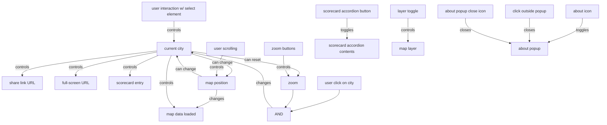

# Parking Lot Map

The code behind https://parkingreform.org/parking-lot-map/.

The code is fairly simple. We do not use frameworks like React or Svelte to keep things simple. However, we do use these techniques:

* TypeScript
* Sass and the folder `src/css/theme`, which should stay aligned with https://github.com/ParkingReformNetwork/reform-map
* Reactive state management - see [State diagram](#state-diagram)

The main files are `index.html`, `src/js/main.ts`, `data/city-stats.json`, and `data/*.geojson`. `main.ts` will load the `.geojson` files to dynamically update `index.html` with all our data.

# How tos

All the commands take place in a _terminal_, a text-based interface for interacting with your computer. On macOS, you can open the "Terminal" app. On Windows, you can use "Git Bash", which will be installed when you install Git below.

You will also need to install:

- Git, which we use for "version control": https://git-scm.com/book/en/v2/Getting-Started-Installing-Git
- NPM, which is how we run JavaScript and our tests. Use the LTS at https://nodejs.dev/en/download/

To run the below commands, open your terminal app. Make sure you have `git clone`d the fork of your repository somewhere on your machine. Then, use `cd <directory>` to navigate there, e.g. `cd code/parking-lot-map`.

## Prereq: install

You must first install the project's dependencies before running any of the below commands.

```bash
❯ npm install
❯ npx playwright install
```

## Start the server

```bash
❯ npm start
```

Then open http://127.0.0.1:1234 in a browser. Hit `CTRL-C` to stop the server.

When the server is running, you can make any changes you want to the project. Reload the page in the browser to see those changes. (You may need to force reload, e.g. hold the shift key while reloading on macOS.)

## Run tests

```bash
❯ npm test
```

If the tests are taking a long time to start, run `rm -rf .parcel-cache` and try the tests again.

## Autoformat code

```bash
❯ npm run fmt
```

## Lint code

"Linting" means using tools that check for common issues that may be bugs or low code quality.

```bash
❯ npm run lint
```

## Update score card for existing city

Manually edit the values in the file `data/city-stats.json`.

Run the site with `npm start` and make sure it's what you want.

Then, save your changes in Git (in a new branch) and open a pull request. See the section "Make a contribution" below.

## Update parking lot data for existing city

Export the GeoJSON file and save it as the file `parking-lots-update.geojson` in the root of this repository. If the file already exists, overwrite it with your new data.

Then, determine the city/state name. This is the same as what we show in the city toggle on the site, e.g. `St. Louis, MO`.

Now, run the below but replace the last part with the city/state name (in single quotes!):

```bash
❯ npm run update-lots -- 'My City, AZ'
```

Run the site with `npm start` and make sure it's what you want. Also, autoformat the file with `npm run fmt`.

Then, save your changes in Git (in a new branch) and open a pull request. See the section "Make a contribution" below.

## Update city boundaries for existing city

Export the GeoJSON file and save it as the file `city-update.geojson` in the root of this repository. If the file already exists, overwrite it with your new data.

Then, determine the city/state name. This is the same as what we show in the city toggle on the site, e.g. `St. Louis, MO`.

Now, run the below but replace the last part with the city/state name (in single quotes!):

```bash
❯ npm run update-city-boundaries -- 'My City, AZ'
```

Start the site with `npm start` and make sure it's what you want. Also, autoformat the file with `npm run fmt`.

Finally, save your changes in Git (in a new branch) and open a pull request. See the section "Make a contribution" below.

## Add a new city

Export the city boundaries' GeoJSON and save it as the file `city-update.geojson` in the root of this repository. If the file already exists, overwrite it with your new data.

Also export the city's parking lots GeoJSON and save it as the file `parking-lots-update.geojson`.

Then, determine the city/state name, such as `St. Louis, MO`.

Now, run the below but replace the last part with the city/state name (in single quotes!):

```bash
❯ npm run add-city -- 'My City, AZ'
```

Next, manually fill in the score card entries in the file `data/city-stats.json`. Search for the city name and update the values.

Start the site with `npm start` and make sure it's what you want. Also, autoformat the file with `npm run fmt`.

Finally, save your changes in Git (in a new branch) and open a pull request. See the section "Make a contribution" below.

## Make a contribution

We use the typical forking model to make contributions by opening Pull Requests. See https://docs.github.com/en/get-started/quickstart/contributing-to-projects.

## Releases

### Try out a build locally

You can preview what a build will look like by running `npm run build`. Then use `npm run serve-dist` to start the server.

You can also run our integration tests on built dist folder with `npm run test-dist` (make sure the server is not already running).

### Staging

We use continuous deployment, meaning that we re-deploy the site every time we merge a pull request to staging at https://parkingreform.org/plm-staging/. You can check how the site renders about ~1-2 minutes after your change merges.

### Production

After you've confirmed staging looks good at https://parkingreform.org/plm-staging/, you can manually trigger a deploy.

Go to https://github.com/ParkingReformNetwork/parking-lot-map/actions and open the "Deploy to prod" workflow. Initiate a build.

## State diagram

This shows all possible user interactions on the map, and what triggers what.



We use [reactive programming](https://en.wikipedia.org/wiki/Reactive_programming) to manage the application's state. This paradigm separates out state management from how the UI should render. Whenever the state is changed, the relevant UI elements will automatically update. For example:

```typescript
// Keep track of the value of a counter, starting at 0.
const counterObservable = new Observable<number>(0);

// Get existing DOM elements
const counterDisplay = document.getElementById('counter-display')!;
const incrementButton = document.getElementById('increment-button')!;

// Whenever the count changes values, this will re-render the UI with the
// updated value.
counterObservable.subscribe((count) => {
  counterDisplay.textContent = `Count: ${count}`;
});

// This binds the button to the counter so that when you click the button, the
// counter increases its value by 1. The call to .setValue() will then cause
// everything that has called `counterObservable.subscribe` to re-render.
incrementButton.addEventListener('click', () => {
  counterObservable.setValue(counterObservable.getValue() + 1);
});

// Initialize the UI
counterObservable.initialize();
```

Look at `Observable.ts` and its usages for how we use the reactive paradigm.
